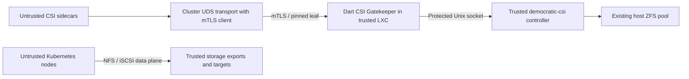

# Architecture and threat model

Atlas controls the privileged Proxmox storage LXC, its configuration, transport
credentials, democratic-csi process, dataset parents, shares and targets. The
cluster, its administrators, StorageClasses, PVCs, snapshots, metadata and nodes
are untrusted. A cluster certificate authorizes the entire configured domain.
It provides no namespace-level authorization. A compromised cluster certificate
has this same intentionally broad authority.

## Mandatory deployment prerequisites

- Atlas assigns exclusive volume and detached-snapshot ZFS dataset parents to
  each backend. No unrelated or foreign resources, foreign origins or foreign
  CSI-managed objects may be placed beneath them. No other cluster shares these
  parents. Existing host ZFS remains the only ZFS stack; Atlas provisions access
  from the trusted LXC. The proxy neither installs ZFS nor configures Proxmox.
- A separate democratic-csi controller is pinned to the audited commit and
  configured in controller mode with CSI **1.9.0**. It listens only on its Unix
  socket. Disable TCP listeners and prevent cluster network access to the socket,
  process, host management endpoints and SSH. Protect the containing directory
  and socket with ownership and modes (for example directory 0750, socket 0660).
  Only the gateway and trusted backend users may access it.
- Backend ID generation is the default name identity: no `_private.csi.volume`
  `idTemplate` or `idHash`. Dataset parents must equal the trusted local proxy
  configuration. They use simple pool/component characters without regex
  metacharacters, because the backend also uses them in regular expressions.
- NFS mountpoints follow the configured exact `share` template. iSCSI names use
  the default leaf name, fixed `namePrefix`/`nameSuffix`, and fixed basename; no
  parameter-dependent `nameTemplate`. Different domains have distinct iSCSI
  asset prefixes/basenames. Backend-owned dataset properties, templates, LIO
  attributes and export options never depend on uncontrolled client fields.
  Disable request-derived configuration overlays and `load-config-from-pvc`.
- Atlas configures host/LXC privileges and direct NFS and iSCSI restrictions.
  Foreign exports and targets must be inaccessible to cluster nodes. A valid
  management proxy **does not protect foreign unguarded exports or targets**.
  Data traffic bypasses this proxy. All nodes may be malicious; do not rely on
  Kubernetes NetworkPolicy or cluster-maintained IP allowlists as the sole
  storage-server data-plane boundary.
- Atlas controls the server certificate, client CA and single leaf fingerprint.
  Clients validate the server CA and hostname. The proxy trusts only the
  configured client CA and requires a client certificate at TLS handshake. Each
  supported RPC then checks its SHA-256 DER leaf fingerprint. A CA-signed leaf
  with a different fingerprint is rejected. Rotation requires a trusted local
  configuration update and restart. There is no plaintext external mode.

## Why no persistent object registry

The pinned backend constructs volume paths as `volumeParent + '/' + leafId`.
Native snapshots use that same parent with `leafId@leafName`; detached snapshots
use `snapshotParent + '/' + leafId + '/' + leafName`. Request validators enforce
these exact component counts and separator positions. They prohibit arbitrary
parents, slashes in leaves, traversal, shell syntax, whitespace, argument-leading
hyphens and targetcli command separators. A foreign full dataset ID cannot pass.
An identical leaf from another cluster resolves to this backend's own domain.
No `startsWith` ownership test or filesystem path normalization is used for ZFS.

Exclusive backend parents and fixed asset templates are the ownership authority.
This permits recovery and CSI idempotency through democratic-csi's durable ZFS
properties without a proxy database or a race-prone in-memory object registry.
The proxy does not promise isolation if Atlas mixes domains under those parents,
imports foreign clone origins or permits colliding target templates. A migration
from a mixed backend needs a separate design and persistent ownership mapping;
it is outside this profile.

## Request and response boundary

Only typed Identity and Controller services are registered. Unsupported Controller
methods and all Node/group-snapshot methods cannot reach the backend. Every known
request type has an explicit field allowlist; unknown protobuf fields are rejected
at the original wire level, including map-entry fields and overwritten nested
oneof values. Known unreviewed nonempty/present fields fail validation. The proxy
forwards no incoming gRPC metadata. Backend errors retain CSI status codes but
lose messages, details and metadata. Audit events contain only a fixed method
name and numeric status, never IDs, requests, response contents or secrets.

Responses must use this profile's ID grammar and exact export/target context.
Create/Get responses are bound to the requested IDs; clone origins and snapshot
source relationships are checked. Entire list responses fail on a foreign or
unreviewed entry; the proxy does not silently hide a misconfigured backend.
Unknown backend protobuf fields fail closed as well. The trusted backend remains
responsible for correct side effects: an invalid response can be detected after
an operation has already executed and cannot be rolled back by the proxy.

Pagination fetches one unpaginated backend list and validates every entry. It
then returns local pages with cryptographically random, method/filter/page-size
bound, replayable tokens. Cache entries expire after five minutes and disappear
on restart; invalid or expired tokens return ABORTED without a backend call.
Clients restart enumeration with an empty token. This avoids the audited
backend's token parser/cache behavior and continuation off-by-one issue. Listing
requires memory proportional to the full list and is not a DoS defense.

## Operational limits

- No fine Kubernetes RBAC, rate limiting, accounting, storage-plane enforcement,
  live backend-configuration attestation or comprehensive DoS protection.
- No publish/unpublish, topology, mount flags/groups, mutable parameters, secret
  overlays, CHAP request parameters, Node RPCs or arbitrary driver profiles.
  NFS supports the reviewed mount capability modes 1–5; iSCSI v1 supports single
  node writer with block or ext4/xfs mount capabilities. New capability modes are
  rejected and SINGLE_NODE_MULTI_WRITER is not advertised.
- No retries of application RPCs are introduced. Deadlines are forwarded as the
  remaining timeout; client cancellation cancels the upstream gRPC call, observed
  at up to 10 ms polling delay because ServiceCall has no cancellation event.
  Cancelling gRPC cannot undo or guarantee interruption of democratic-csi's
  already-running ZFS/LIO command. Retry the same CSI request after uncertain
  outcomes; backend idempotency remains necessary.
- TLS authorization pins a leaf, not a general subject or SAN parser. The Dart
  server supports client certificate requirements and access to the peer leaf.
  Its `ServerCredentials.validateClient` hook is unused in grpc 5.1.0; authorization
  therefore runs in the gateway handlers. No trusted TLS terminator is needed
  on the LXC endpoint. The cluster transport still needs mTLS client support.
- SIGTERM/SIGINT initiate gRPC shutdown. Open peer connections can delay Dart's
  graceful shutdown; the example systemd unit bounds termination at ten seconds.
  In-flight writes may have an uncertain result when the process is terminated.
- Local fake tests verify the proxy boundary, not a full exploit, real ZFS/LIO
  semantics or security of the host, backend and deployment. A staged integration
  qualification with the pinned real driver remains required before production.
